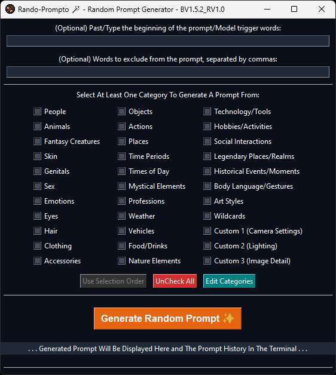
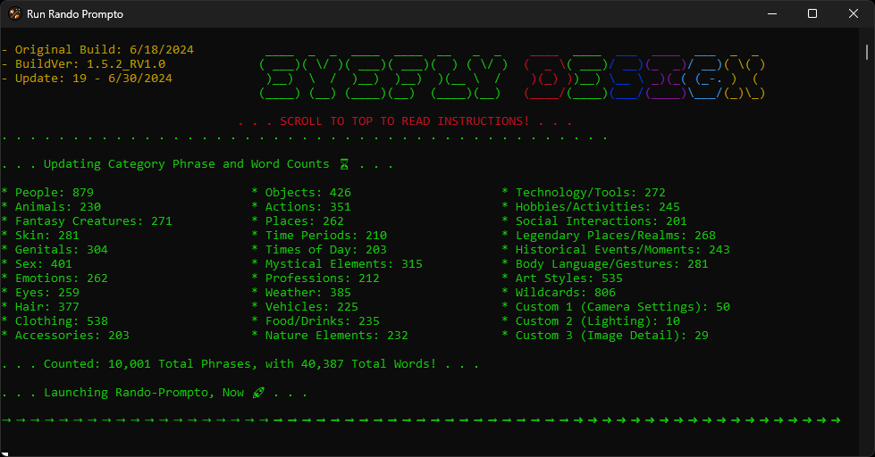
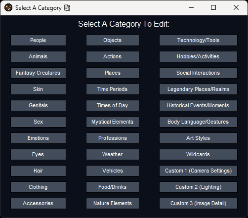
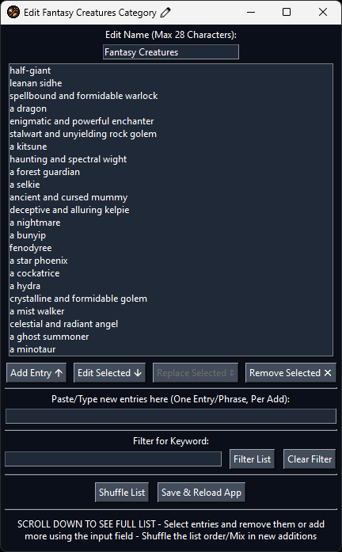
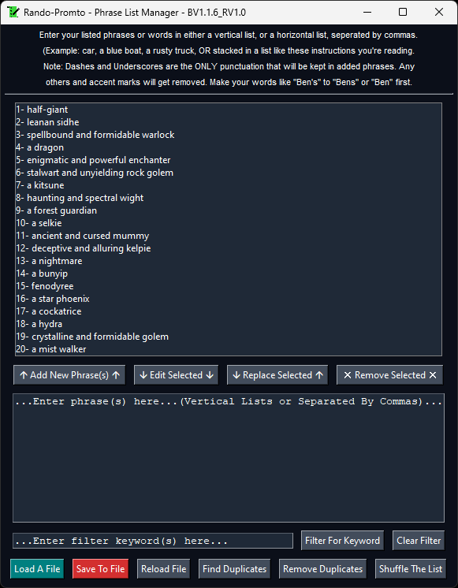

# Rando-Prompto

-This is Rando-Prompto, the customizable random prompt generator.

# Main App

# Teminal View

# Video Explanation
- A video going over the basics of the app can be found here:
  https://youtu.be/dC7moqtbuCM
  
  
# Standalone EXEs added:
* I added an EXE version of the app for people that do not want to install python to use the app.
  It only requires windows 10 or later to run.

# Rquirements For The Python Version:
* This App Requires Python and PIP to be installed to run. Pyperclip is requires as well
  but can be installed with a file in the app folder.

# How to run the app:
* Download the zip file and extract it.
* Inside the app folder will be 3 .bat files. "Run_Rando_Prompto.bat",
  "Run_Rando_Prompto_This_File_Installs_or_Updates_Dependencies_Before_Running_App.bat" and "Run_Phrase_List_Manager.bat".
* Use "Run_Rando_Prompto_This_File_Installs_or_Updates_Dependencies_Before_Running_App.bat" if you do not have
  Pyperclip installed.
* Use "Run_Rando_Prompto.bat" if you already have Pyperclip installed or after installing it.
* Use "Run_Phrase_List_Manager.bat" to run the phrase list manager.
* I recomend making shortcuts of the .bat files ("Run_Rando_Prompto.bat" and "Run_Phrase_List_Manager.bat") and
  use the included icons for them.

# What does Rando-Prompto do?

* Rando-Prompto is a random prompt generator with 10,001 pre-installed phrases to make countless
  prompts.
  
* The user can choose from 33 categories, from people to wildcards, to build the random prompt with the
  kinds of things you want.
  
* The app can add random weights to the prompt.

* The app can randomize the prompt order.

* The user can select the order that the categories are used in the prompt.

* The user can copy the prompt to the clipboard with one button.

* The prompt can be saved to a file.

* The user can edit the categories contents and names using the built in category editor.

* The app comes with a phrase list manager to allow for fast list building and managing the current lists.

# Why is this useful?

* This app can quickly generate a random prompt containing the elements you want when you
  don't feel like writing a prompt yourself.

* With it's pre-installed 10,001 phrases, it will always give you something new, and keep
  things fresh.

* The app is completely customizable, so you can have only the kinds of phrases you want.
  From the category names to the contents, it all can be changed. And with the category
  editor, it is as easy as it can be to add, edit, replace, and remove from the lists,

* The generated prompts may just inspire you to prompt in ways you may not otherwise think of.

# The Standalone EXEs:
* I put the exe versions of Rando-Prompto and the Phrase List Manager in zip files inside the
* main app folder. Feel free to use either one. But the EXE version does not have the terminal
* to display any info or the prompt history.
  
  
# Extra Features:

* I also included the list tools I used to create the original lists. They are a collection of html based tools
  for doing things like removing apostrophes and other punctuation and formatting the lists for use in the manager.
  
* I also included a Backups.zip file to help restore broken list files.

* There are 2 icons included for use with shortcuts of the bat files to launch Rando-Prompto and the manager.

# One More Thing:
I recommend you watch the video I linked under the first two images. It goes over the app in a little more detail.

# Category Select

# Category Editor

# Phrase List Manager

  
